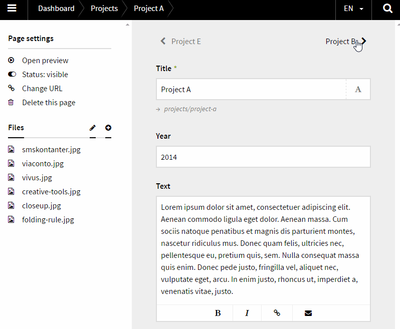

# Kirby Panel Prevnext

*Version 0.1*

Navigate to siblings in the panel. Multilanguage support.



## Installation

Use one of the alternatives below.

### 1. Kirby CLI

If you are using the [Kirby CLI](https://github.com/getkirby/cli) you can install this plugin by running the following commands in your shell:

```
$ cd path/to/kirby
$ kirby plugin:install jenstornell/kirby-panel-prevnext
```

### 2. Clone or download

1. [Clone](https://github.com/jenstornell/kirby-panel-prevnext.git) or [download](https://github.com/jenstornell/kirby-panel-prevnext/archive/master.zip)  this repository.
2. Unzip the archive if needed and rename the folder to `kirby-panel-prevnext`.

**Make sure that the plugin folder structure looks like this:**

```
site/plugins/kirby-panel-prevnext/
```

### 3. Git Submodule

If you know your way around Git, you can download this plugin as a submodule:

```
$ cd path/to/kirby
$ git submodule add https://github.com/jenstornell/kirby-panel-prevnext site/plugins/kirby-panel-prevnext
```

## Setup

### 1. Blueprint

To make it work as expected, add the following code to your blueprint:

```
fields:
  prevnext: prevnext
```

## Changelog

**0.1**

- Inital release 

## Requirements

- [**Kirby**](https://getkirby.com/) 2.3+

## Disclaimer

This plugin is provided "as is" with no guarantee. Use it at your own risk and always test it yourself before using it in a production environment. If you find any issues, please [create a new issue](https://github.com/jenstornell/kirby-panel-prevnext/issues/new).

## License

[MIT](https://opensource.org/licenses/MIT)

It is discouraged to use this plugin in any project that promotes racism, sexism, homophobia, animal abuse, violence or any other form of hate speech.

## Credits

- [Jens Törnell](https://github.com/jenstornell)